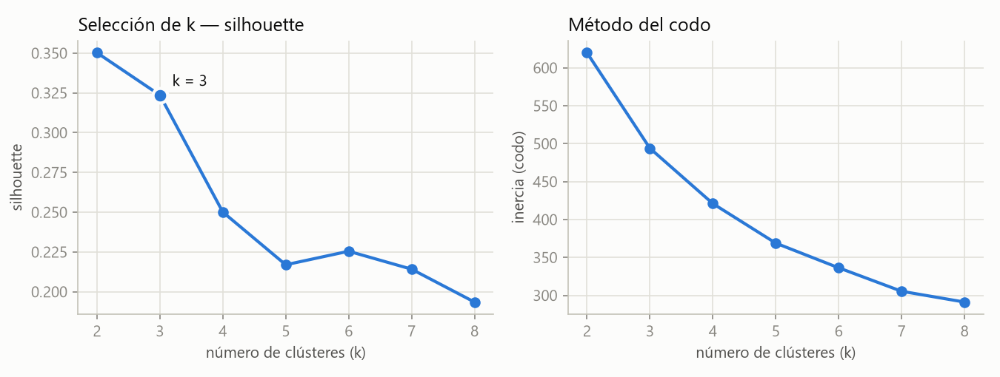
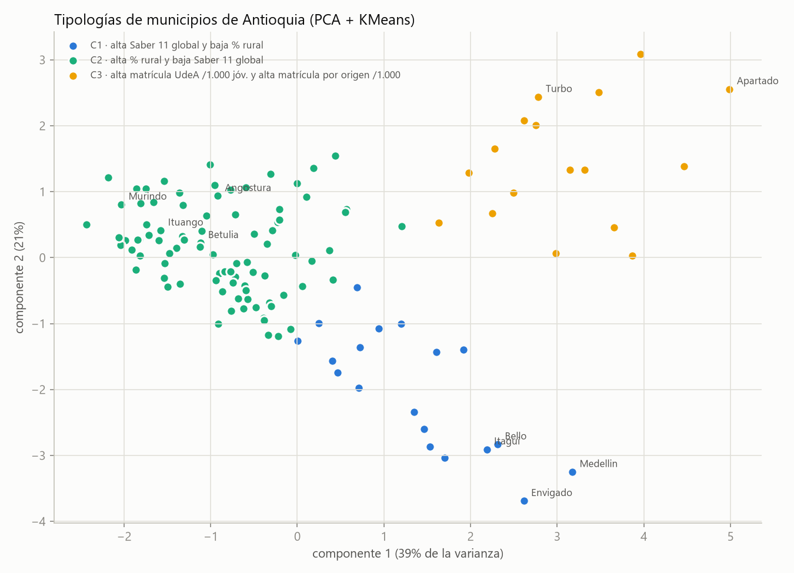
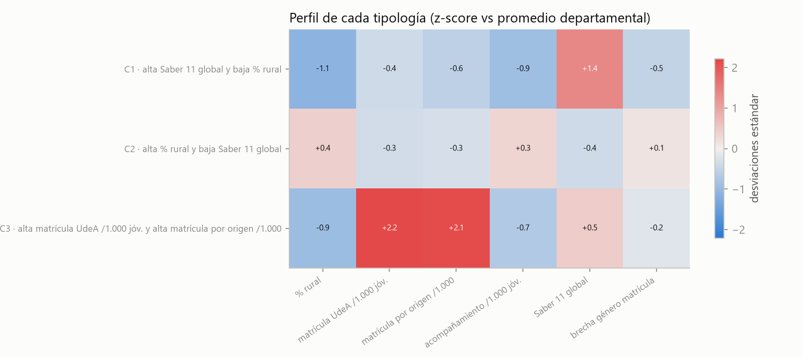
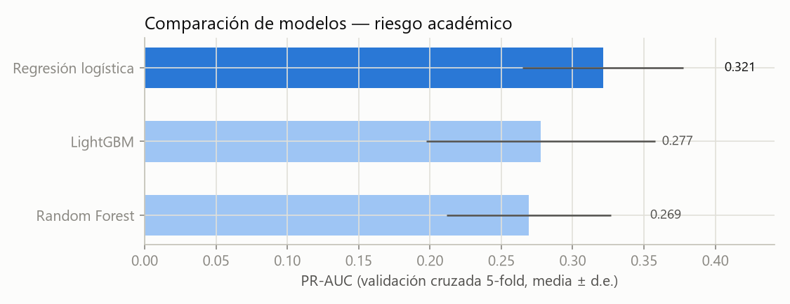
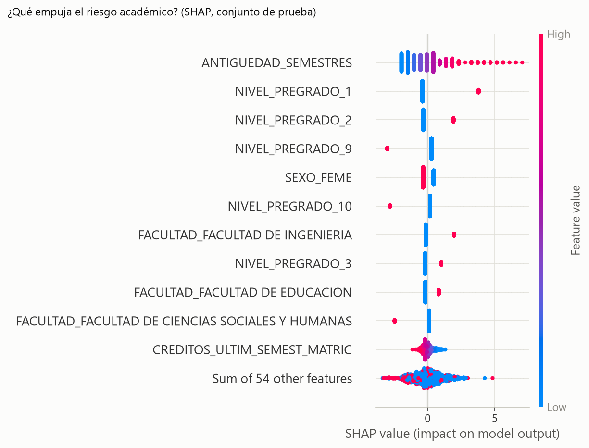

# Memoria técnica — Sustentación metodológica

**Proyecto:** *Del colegio a la universidad: inteligencia territorial para cerrar brechas de acceso y
permanencia en la educación superior de Antioquia.*
**Concurso:** Datos al Ecosistema 2026 — IA para Colombia (nivel intermedio).

Este documento sustenta **por qué** se eligió cada técnica, **cómo** se entrenó y validó cada modelo,
y **cómo interpretar** los valores que produce el proyecto (probabilidad de riesgo, índice de brecha,
ROC-AUC, silhouette, valores SHAP, etc.). Está pensado para que el jurado pueda auditar el criterio
metodológico sin necesidad de leer el código, aunque cada afirmación es reproducible desde `src/`.

> Las cifras de esta memoria provienen de artefactos ya generados y versionados en `outputs/`
> (`tabla_metricas.csv`, `importancia_shap.csv`, `perfil_clusters.csv`, `ranking_brechas.csv`) y de la
> ejecución registrada en `notebooks/02…03`. No hay valores estimados a mano.

---

## 1. Resumen ejecutivo

El proyecto integra cinco fuentes de datos (cuatro de datos.gov.co) sobre el departamento de Antioquia
y responde dos preguntas complementarias con dos técnicas de aprendizaje automático:

| Módulo | Pregunta | Técnica | Tipo |
|---|---|---|---|
| **A** | ¿*Dónde* es mayor la brecha de acceso a la educación superior? | KMeans + índice compuesto | No supervisado |
| **B** | ¿*Quiénes* de los matriculados tienen mayor riesgo de bajo rendimiento? | Clasificación (comparación de 3 modelos) | Supervisado |

**Cuatro resultados clave:**

1. **Tres tipologías de municipios** estables (silhouette 0,32; estabilidad ARI 0,94) que separan
   cabeceras urbanas, municipios rurales rezagados y sedes regionales de la UdeA.
2. **Ranking de brecha 0–100**: Betulia (86,1), Murindó (85,2), Ituango (84,4), Angostura (84,3) y
   Caicedo (83,8) encabezan la priorización territorial.
3. **Modelo de riesgo académico** (regresión logística balanceada) con **ROC-AUC 0,870** en datos no
   vistos; su **decil de mayor riesgo captura el 63 % de los casos reales (lift 6,2×)**: con capacidad
   para acompañar al 10 % de la matrícula se concentra dos tercios del riesgo.
4. **Factores de riesgo interpretables (SHAP)**: antigüedad alta sin avance de nivel, facultad
   (Ingeniería, Educación); ser mujer aparece como factor protector; el contexto municipal aporta
   señal moderada.

---

## 2. Contexto y preguntas

El acceso y la permanencia en la educación superior en Antioquia son desiguales en el territorio: hay
municipios rurales con bajo puntaje Saber 11 y poca matrícula universitaria, y estudiantes que, una
vez matriculados, enfrentan mayor riesgo de bajo rendimiento. El proyecto ataca las dos caras del
problema:

- **Módulo A — mirada territorial (agregada).** Sirve para decidir *dónde* expandir programas de
  acompañamiento (Semestre Cero, Soñares, PIES): identifica y ordena los municipios con mayor brecha.
- **Módulo B — mirada individual (estudiante).** Sirve como **alerta temprana**: estima, para cada
  matriculado, la probabilidad de bajo rendimiento, de modo que bienestar universitario pueda
  priorizar el acompañamiento humano.

Ambos módulos se conectan: el contexto municipal calculado en A (ruralidad, Saber 11 local, cobertura
de acompañamiento) entra como variables de contexto en el modelo individual de B.

---

## 3. Datos y construcción de la base analítica

**Cinco conjuntos integrados** (cuatro de datos.gov.co), unidos por una única llave: el **código DANE
de municipio (5 dígitos)**.

| # | Conjunto | Fuente |
|---|---|---|
| 1 | Matriculados UdeA sedes regionales 2026-1 | Universidad de Antioquia (local) |
| 2 | Beneficiarios de programas de acompañamiento | datos.gov.co — Gobernación de Antioquia |
| 3 | Población Antioquia censada 2018 | datos.gov.co — Gobernación / DANE |
| 4 | Resultados únicos Saber 11 | datos.gov.co — ICFES (API Socrata) |
| 5 | DIVIPOLA — códigos de municipios | datos.gov.co — DANE (API Socrata) |

**Homologación y control de calidad.** Los nombres de municipio se validan contra DIVIPOLA con una
**auditoría difusa** (`rapidfuzz`, `token_sort_ratio ≥ 85`); el cruce logrado es del **100 %** en todas
las fuentes (`src/integrate.py`). Distinción explícita entre **cero real** y **faltante**: la ausencia
de matriculados o beneficiarios en un municipio se codifica como `0` (no como dato perdido), mientras
que un promedio Saber inexistente sí es faltante.

**Dos matrices analíticas** resultantes:

- **Matriz municipal** — 125 municipios × ~19 variables → alimenta el Módulo A.
- **Matriz de estudiantes** — 8.157 matriculados × features + columnas para construir el target →
  alimenta el Módulo B.

**Un quirk de dominio importante:** en la fuente de matriculados, `PROMEDIO_PROGRAMA = 9.99` es un
**valor centinela** que significa "sin historia académica" (estudiante de primer semestre), no un
promedio real. Se trata explícitamente al definir la población modelable (§5).

---

## 4. Módulo A — Tipologías de municipios e índice de brecha (no supervisado)

### 4.1 Por qué clustering

No existe una "etiqueta" de tipo de municipio que aprender; el objetivo es **descubrir estructura**:
agrupar municipios parecidos en su situación educativa. Es un problema no supervisado y KMeans es la
elección estándar, barata e interpretable para segmentación sobre variables numéricas estandarizadas.

### 4.2 Variables y preprocesamiento

Se usan **7 variables** de bajo porcentaje de faltantes (población joven en `log10` para atenuar el
peso de Medellín; % rural; dos tasas de matrícula per cápita; tasa de acompañamiento; Saber 11 global;
brecha de género en matrícula). Todas se **estandarizan a z-score** (media 0, desviación 1) para que
ninguna domine la distancia por su escala, y los faltantes se **imputan con la mediana** (se reporta
cuántos por variable). Se **excluyen deliberadamente** de la distancia las variables con imputación
masiva (p. ej. brecha oficial/no oficial, ausente en 85 de 125 municipios): imputar >50 % con la
mediana distorsionaría los clústeres. Esas variables se conservan sólo como contexto en el ranking.

### 4.3 Selección de k

Se prueba k = 2…8 y se elige por **silhouette máximo con la restricción k ≥ 3**. El k = 2 maximiza el
silhouette global, pero sólo reproduce la dicotomía urbano/rural, sin valor accionable como tipología;
se reporta la tabla completa (silhouette + codo) por transparencia. **k = 3** es la solución elegida.



### 4.4 Calidad y estabilidad de la solución

- **Silhouette ≈ 0,32** — cohesión/separación moderada, razonable para datos socioeconómicos reales
  (rango teórico −1 a 1; >0,25 indica estructura utilizable).
- **Estabilidad ARI ≈ 0,94** — el *Adjusted Rand Index* promedio contra 5 semillas alternativas es muy
  alto (rango −1 a 1; 1 = partición idéntica): la agrupación **no** depende de la semilla aleatoria.

### 4.5 Las tres tipologías

Cada clúster se nombra automáticamente por sus dos rasgos más desviados del promedio departamental
(perfil z-score en `outputs/perfil_clusters.csv`):

| Tipología | Nº municipios | Perfil dominante | Brecha media |
|---|---|---|---|
| **C1** — cabeceras urbanas | 19 | Saber 11 **alto**, ruralidad **baja** | 61,8 |
| **C2** — rurales rezagados | 89 | ruralidad **alta**, Saber 11 **bajo** | 72,1 |
| **C3** — sedes regionales UdeA | 17 | matrícula UdeA per cápita **alta** | 50,5 |





> **Cómo leer el perfil (z-score).** Cada celda es cuántas desviaciones estándar se aparta la
> tipología del promedio departamental en esa variable. `+1,4` en Saber 11 = muy por encima del
> promedio; `−1,1` en % rural = muy por debajo. El signo dice la dirección; la magnitud, la intensidad.

### 4.6 Índice de brecha (0–100)

Es un **índice compuesto**, independiente del clustering, para **ordenar** municipios por urgencia. Se
construye con cuatro componentes normalizados min-max a [0, 1] y promediados, orientando cada uno para
que **más valor = más brecha**:

| Componente | Dirección |
|---|---|
| Tasa de matrícula UdeA per cápita | ↓ menos matrícula → más brecha |
| Saber 11 global | ↓ menor puntaje → más brecha |
| % rural | ↑ más rural → más brecha |
| Tasa de acompañamiento | ↓ menos cobertura → más brecha |

El resultado se escala a 0–100. **Top 5 de brecha** (`outputs/ranking_brechas.csv`): Betulia 86,1 ·
Murindó 85,2 · Ituango 84,4 · Angostura 84,3 · Caicedo 83,8 — todos de la tipología C2 (rural
rezagada). Son los candidatos naturales para expandir los programas de acompañamiento.

El mapa interactivo autocontenido está en [`outputs/mapa_brechas.html`](../outputs/mapa_brechas.html)
(tamaño = población joven; color = índice de brecha).

> **Cómo leer el índice.** 0 = sin brecha relativa; 100 = brecha máxima *dentro de Antioquia*. Es un
> valor **relativo** (comparativo entre municipios del departamento), no una medida absoluta.

---

## 5. Módulo B — Modelo de riesgo académico (supervisado)

### 5.1 Población modelable y definición del target

Sólo tiene sentido predecir el rendimiento de quien **ya tiene historia académica**. Se modela sobre
**6.455 estudiantes** (`PROMEDIO_PROGRAMA ≤ 5` y `NUMSEMESTRES > 1`), excluyendo **1.702** matriculados
sin historia (centinela 9.99, §3) de los 8.157 originales.

- **Target primario — `RIESGO = 1`** si `PROMEDIO_PROGRAMA < 3.0` **o** el estudiante ha estado en
  período de prueba (`PERIODOS_PRUEBA_PROGRAMA ≥ 1`). **Prevalencia: 4,6 % (297 casos)** → clase
  **muy desbalanceada**; este hecho gobierna la elección de métricas (§5.4).
- **Target alternativo — rezago** (créditos aprobados < 75 % de lo esperado según semestres cursados),
  usado sólo para el análisis de sensibilidad (§5.6). Prevalencia 13,8 %.

### 5.2 Prevención de fuga de información (*leakage*)

Las variables que **construyen** el target — `PROMEDIO_PROGRAMA`, `PERIODOS_PRUEBA_PROGRAMA`,
`CREDAPROBADOS`, `CREDGRADO`, `NUMSEMESTRES` — **no** se usan como predictores. Incluirlas inflaría
artificialmente las métricas y haría el modelo inútil en la práctica. El modelo predice el riesgo a
partir de **perfil y contexto**, no de las notas que definen el resultado.

### 5.3 Variables predictoras (15) y preprocesamiento

- **6 categóricas** — sexo, sede, facultad, tipo de aceptación, naturaleza del colegio, nivel de
  pregrado. Codificadas con `OneHotEncoder(handle_unknown="ignore", min_frequency=20)`: las categorías
  raras se agrupan y las nunca vistas se ignoran, evitando que el modelo falle con un valor nuevo.
- **9 numéricas** — edad, estrato (con indicador `ESTRATO_FALTANTE`), antigüedad, créditos del último
  semestre, y el **contexto municipal heredado del Módulo A** (% rural, Saber 11 local, tasa de
  acompañamiento) más "vive fuera de Antioquia". Imputación por **mediana**; `StandardScaler` sólo para
  la regresión logística (los modelos de árbol no lo necesitan).
- **Desbalance** — se compensa con `class_weight="balanced"` (regresión logística y Random Forest) e
  `is_unbalance=True` (LightGBM), no con remuestreo, para no distorsionar las probabilidades.

### 5.4 Entrenamiento, validación y criterio de selección

- **Partición**: 80 % entrenamiento / 20 % *held-out*, estratificada por el target.
- **Validación cruzada** `StratifiedKFold` de **5 pliegues** sobre el conjunto de entrenamiento — la
  estratificación mantiene el 4,6 % de positivos en cada pliegue.
- **Criterio de selección: PR-AUC** (área bajo la curva *precision-recall*). Con clases muy
  desbalanceadas, la PR-AUC es más informativa que el *accuracy* o la ROC-AUC, porque se concentra en
  la clase minoritaria (los estudiantes en riesgo, que es lo que importa).

**Comparación de los tres modelos** (validación cruzada, `outputs/tabla_metricas.csv`):

| Modelo | ROC-AUC (CV) | PR-AUC (CV) | F1 (CV) |
|---|---|---|---|
| **Regresión logística** (balanceada) | **0,874 ± 0,018** | **0,321 ± 0,056** | 0,292 |
| Random Forest | 0,859 ± 0,012 | 0,269 ± 0,058 | 0,312 |
| LightGBM | 0,849 ± 0,022 | 0,277 ± 0,080 | 0,258 |



**Gana la regresión logística**: mejor PR-AUC y ROC-AUC, la menor varianza entre pliegues (más estable)
y, además, el modelo más simple e interpretable — un empate técnico se resuelve a favor de la
transparencia, deseable para una herramienta que afecta decisiones sobre personas.

### 5.5 Desempeño en datos no vistos (*held-out*)

| Métrica | Valor | Lectura |
|---|---|---|
| **ROC-AUC** | **0,870** | Alta capacidad de ordenar riesgo vs no-riesgo |
| PR-AUC | 0,314 | ≈ **6,8× la línea base** (0,046 = prevalencia) |
| F1 @ umbral 0,5 | 0,285 | Bajo — el umbral 0,5 no es el punto de operación útil |

> **Por qué la PR-AUC "parece baja" y no es un problema.** Con 4,6 % de positivos, un clasificador
> aleatorio obtiene PR-AUC ≈ 0,046. El modelo alcanza 0,314: casi **7 veces** mejor que el azar. En
> problemas muy desbalanceados los valores absolutos de PR-AUC y F1 son naturalmente bajos; lo
> relevante es la mejora sobre la línea base y, sobre todo, el uso operativo por ranking (abajo).

**Indicador operativo — lift del decil superior.** En lugar de clasificar con umbral 0,5, se ordenan
los estudiantes por probabilidad y se mira el **10 % de mayor riesgo**:

- **Captura el 63 % de los casos reales** de riesgo.
- **Lift 6,2×**: ese decil concentra 6,2 veces más riesgo que la media.

Esto se traduce directamente en política: **con capacidad para acompañar al 10 % de la matrícula, se
alcanza a dos tercios de los estudiantes realmente en riesgo.** Es el número que sustenta el valor
práctico del modelo.

### 5.6 Análisis de sensibilidad

El mismo pipeline, entrenado sobre el **target alternativo de rezago**, alcanza **ROC-AUC 0,979** y
PR-AUC 0,865. Que el desempeño se mantenga (y mejore) bajo una definición distinta del resultado
indica que la señal es **robusta a la definición del target**, no un artefacto de un umbral concreto.

---

## 6. Interpretabilidad — valores SHAP

Un modelo de alerta temprana debe ser **explicable**. Se usan **valores SHAP** (SHapley Additive
exPlanations): reparten la predicción entre las variables de forma teóricamente fundamentada. Para la
regresión logística, el valor SHAP de una variable es proporcional a `coeficiente × (valor − media)`,
de modo que **el signo indica la dirección** (empuja hacia riesgo o lo protege) y **la magnitud, la
fuerza**.



**Factores principales** (|SHAP| medio, `outputs/importancia_shap.csv`):

| Variable | Importancia (SHAP medio) | Lectura |
|---|---|---|
| Antigüedad (semestres) | 1,19 | Mucha antigüedad **sin avance de nivel** empuja el riesgo |
| Nivel de pregrado | 0,76 / 0,54 / … | Combinado con la antigüedad: rezago en el avance |
| Sexo (mujer) | 0,38 | En el beeswarm aparece como **factor protector** |
| Facultad (Ingeniería, Educación) | 0,30 / 0,28 | Mayor riesgo asociado a ciertas facultades |
| Contexto municipal (Saber 11, % rural) | 0,09 / 0,09 | Señal **moderada** pero presente |

> **Magnitud ≠ dirección.** La tabla de importancia ordena por *magnitud* (cuánto pesa una variable);
> la *dirección* (si sube o baja el riesgo) se lee en el **beeswarm**, donde el color es el valor de la
> variable y la posición horizontal es el empuje hacia riesgo. Por eso "ser mujer" tiene peso alto
> **y** actúa como protector: dos lecturas distintas de la misma figura.

Que el contexto municipal aporte sólo señal moderada es coherente y deseable: el riesgo individual se
explica sobre todo por la **trayectoria** del estudiante, no por su municipio de origen.

---

## 7. La calculadora de riesgo — interpretación de la probabilidad

El pipeline completo (preprocesamiento + modelo) se serializa en `outputs/modelo_riesgo.pkl` y alimenta
la **calculadora interactiva** de la app Streamlit (pestaña «Predicción individual» del Módulo B).

**Flujo.** El usuario ingresa el perfil de un estudiante (hipotético); al elegir el municipio, el
contexto territorial (% rural, Saber 11 local, acompañamiento) se **autocompleta** desde
`outputs/ranking_brechas.csv` (salida del Módulo A), para no pedir datos que no se conocen. Los campos
categóricos sólo ofrecen las categorías vistas en el entrenamiento, así el formulario nunca propone un
valor que el modelo no reconoce. La salida es `predict_proba` → una **probabilidad de riesgo** en
porcentaje.

**Cómo leer el valor:**

- Es una **probabilidad** (0–100 %), no una clasificación binaria dura.
- La app muestra una **alerta cuando es ≥ 50 %**, pero el uso más potente es **por ranking**: ordenar y
  atender primero a los de mayor probabilidad (el decil superior captura el 63 % del riesgo, §5.5).
- **No es un diagnóstico individual.** Es un **apoyo estadístico** para priorizar acompañamiento; debe
  leerse junto con el criterio humano de bienestar universitario (§9).

---

## 8. Glosario de indicadores

| Indicador | Qué mide | Rango | Cómo interpretar el valor obtenido |
|---|---|---|---|
| **ROC-AUC** | Capacidad de ordenar positivos por encima de negativos | 0,5–1 | 0,870 = alta discriminación |
| **PR-AUC** | Precisión-recall sobre la clase minoritaria | prevalencia–1 | 0,314 vs base 0,046 → ~7× el azar |
| **F1** | Balance precisión/recall a un umbral | 0–1 | 0,285 @ 0,5; el umbral no es el punto útil |
| **Lift (decil)** | Concentración de casos en el 10 % top | ≥ 1 | 6,2× = seis veces la media |
| **Captura del decil** | % de casos reales en el 10 % top | 0–100 % | 63 % |
| **Silhouette** | Cohesión vs separación de clústeres | −1 a 1 | 0,32 = estructura moderada, utilizable |
| **ARI** | Estabilidad de la partición entre semillas | −1 a 1 | 0,94 = muy estable |
| **z-score** | Desviaciones estándar respecto al promedio | típ. −3 a 3 | signo = dirección; magnitud = intensidad |
| **Índice de brecha** | Urgencia territorial relativa | 0–100 | relativo a Antioquia, no absoluto |
| **Valor SHAP** | Contribución de una variable a una predicción | real (±) | signo = dirección; magnitud = fuerza |

---

## 9. Limitaciones, sesgos y ética

- **Corte transversal.** Los datos son una foto del período 2026-1; el modelo no captura evolución
  temporal ni relación causal — identifica **asociación**, no causa.
- **Herencia de desigualdades.** El modelo aprende de un sistema educativo históricamente desigual; el
  informe hace **explícitas** esas desigualdades (contexto rural, Saber 11 local) en lugar de
  ocultarlas. La verificación de que el contexto municipal pesa sólo de forma moderada mitiga el riesgo
  de penalizar a un estudiante por su territorio.
- **Uso previsto.** El scoring se diseñó para **priorizar acompañamiento**, **nunca** para restringir
  el acceso a servicios ni como diagnóstico individual.
- **Privacidad.** Los datos de estudiantes están **anonimizados**; la salida (`scoring_estudiantes.csv`)
  no contiene identificadores personales.

---

## 10. Reproducibilidad

Pipeline determinista (semilla `SEED = 42` en todos los pasos aleatorios):

```bash
.venv\Scripts\python src/acquire.py     # descarga datasets 4 y 5 (API datos.gov.co)
.venv\Scripts\python src/clean.py       # limpieza -> data/processed/*.parquet
.venv\Scripts\python src/integrate.py   # homologación DANE + matrices municipal y de estudiantes
.venv\Scripts\python src/module_a.py    # clustering + índice de brecha + mapa + figuras
.venv\Scripts\python src/module_b.py    # modelo de riesgo + métricas + SHAP + scoring + .pkl
```

Los notebooks `notebooks/01…03` narran el mismo proceso (limpieza · Módulo A · Módulo B) ejecutando
estas mismas funciones. **Nota de versiones:** un `.pkl` deserializado con una versión de
`scikit-learn` / `numpy` / `scipy` distinta a la de entrenamiento puede comportarse de forma
inesperada; si se reentrena, fijar esas versiones en `requirements.txt` antes de reconstruir la imagen.

---

*Documento de sustentación metodológica. Para la guía de ejecución y despliegue, ver el
[`README.md`](../README.md).*
